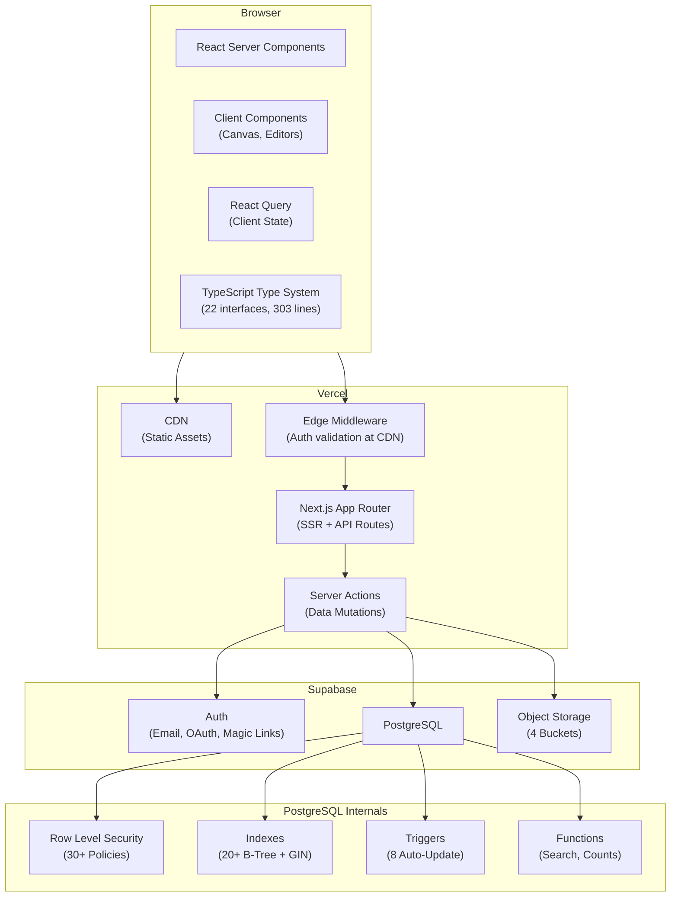
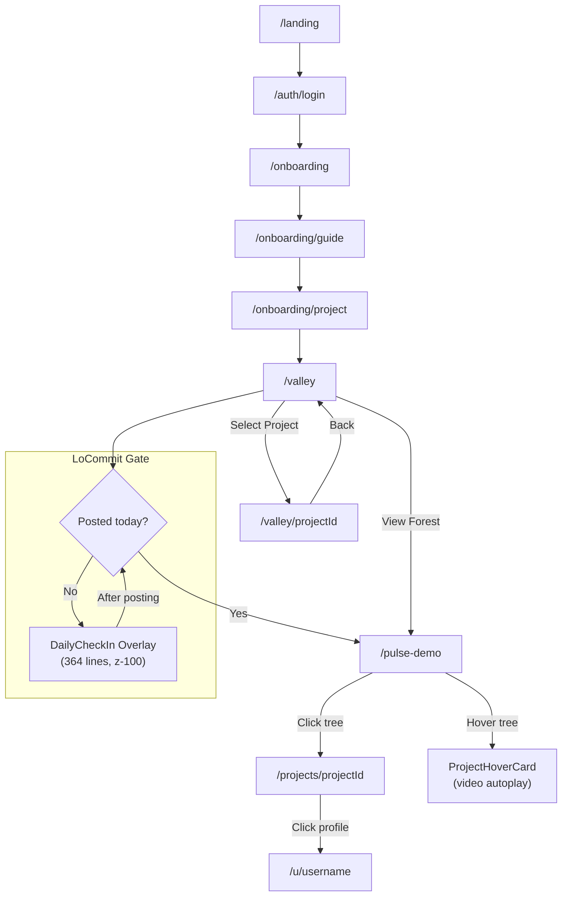
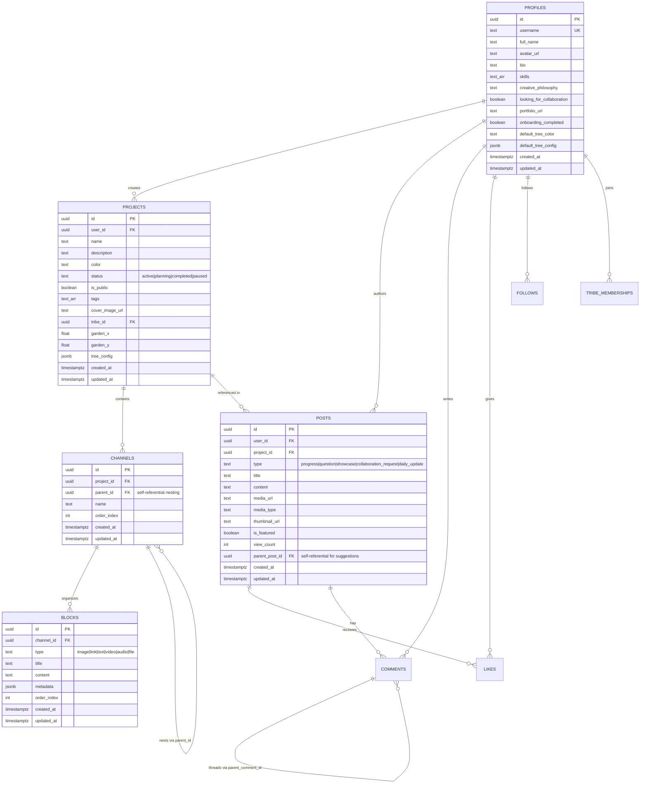

# Trybe — Capstone Project Report

---

## Table of Contents

1. What Trybe Is
2. Software Architecture
3. How the Application Works — User Walkthroughs
4. Application Routes
5. Database Schema
6. Technical Challenges
7. Development Timeline
8. User Testing
9. Strengths and Limitations
10. Future Work
11. References
12. AI Statement

**Appendices** *(see companion file: `capstone_revised_draft_part2.md`)*

---

## 1. What Trybe Is

Trybe is a web application for independent creators who work on personal projects — designers, musicians, developers, and other practitioners who build things over time. It combines a project workspace, a daily check-in system, and a community visualization into one tool. The application is live at [trybe-six.vercel.app](https://trybe-six.vercel.app).

The application solves a practical problem: creators typically use several disconnected tools (Notion for planning, Pinterest for references, Figma for design, Discord for community). Trybe puts all of these functions in one place and adds a daily accountability system that doesn't exist in any of those tools.

The application has three parts:

| Part | What it does |
|------|-------------|
| **Project Valley** | A private workspace where users organize projects into folders (Channels) and individual items (Blocks — text, images, videos, links, files) |
| **LoCommit** | A daily check-in that locks social features until the user posts a progress update. The lock resets every day at 9:00 AM Taiwan time |
| **The Forest** | A shared canvas where every project is drawn as a tree. Trees grow taller as users post more updates. Inactive projects visibly wither |

---

## 2. Software Architecture

### 2.1 Stack

| Layer | Technology | Why this choice |
|-------|-----------|----------------|
| Frontend | Next.js 15 (App Router) | Needed both server-rendered public pages and interactive dashboards in one codebase |
| UI | Tailwind CSS + Radix UI | Radix provides accessible UI primitives (keyboard navigation, screen readers); Tailwind handles styling |
| Backend | Supabase | Provides auth, database, and file storage as a single service. As a solo developer, this eliminated the need to configure and connect separate AWS services |
| Database | PostgreSQL | The data model is hierarchical (Project → Channel → Block). PostgreSQL enforces this with foreign keys and cascade deletes — orphaned data is impossible |
| Security | Row Level Security (RLS) | 30+ database-level policies control who can read and write what. Security is enforced by the database engine, not by application code |
| Search | pg_trgm + GIN indexes | Fuzzy full-text search handled entirely by PostgreSQL. No external search service needed |
| Deployment | Vercel | Automatic deployment from GitHub pushes. Static assets served from a CDN |
| File Storage | Supabase Storage | S3-compatible object storage. Four buckets for different upload categories |
| Type System | TypeScript (22 interfaces) | Full end-to-end type safety from database queries through React components. 303 lines of type definitions in `src/types/index.ts` |

### 2.2 Architecture Diagram



### 2.3 Type System

The entire application is typed end-to-end using TypeScript. The `src/types/index.ts` file (303 lines) defines 22 interfaces that serve as the shared contract between the database layer, the data access layer, and the React components:

| Category | Types | Purpose |
|----------|-------|---------|
| Core Enums | `BlockType`, `ProjectStatus`, `PostType`, `TribeRole`, `LikeType`, `NotificationType`, `CollaborationStatus` | Constrain all string values to known options |
| Domain Models | `Profile`, `Project`, `Channel`, `Block`, `Post`, `Comment`, `Like`, `Follow`, `Tribe`, `TribeMembership`, `Notification`, `CollaborationRequest`, `ProjectSave` | Map 1:1 to database tables |
| Custom Types | `TreeConfig` | Configuration for per-project tree rendering (`palette`, `trunkStyle`, `branchAngle`, `foliage`, `growthDirection`) |
| UI State | `View`, `ProjectView`, `BlockView` | Page-level view modes |
| API | `PaginatedResponse<T>`, `SearchResult<T>` | Generic response wrappers |
| Forms | `CreateProjectForm`, `CreateTribeForm`, `CreatePostForm`, `CreateBlockForm` | Input validation shapes |
| Filters | `ProjectFilters`, `PostFilters`, `TribeFilters`, `SortOption` | Query parameter types |

The `TreeConfig` interface is particularly important — it defines how each project's tree renders in the Forest:

```typescript
export interface TreeConfig {
  palette: string           // Color scheme
  trunkStyle: 'solid' | 'dotted' | 'circuit' | 'fluid'  // Line pattern
  branchAngle: number       // Degree offset for engagement branches
  foliage: 'orb' | 'cursor' | 'sprite'   // Terminal node style
  growthDirection: 'up' | 'down'           // Trunk direction
}
```

This means every user can customize how their tree looks in the Forest — trunk line style, color palette, and growth direction — while the tree's *size* and *health* are determined by their actual contribution data.

### 2.4 Data Access Architecture

All 55 database queries are contained in a single service module (`src/lib/supabase/queries.ts`, 973 lines). No React component directly constructs SQL or calls the Supabase client. The module is organized by domain:

| Domain | Functions | Examples |
|--------|-----------|---------|
| Profile | 6 | `getProfile()`, `getProfileByUsername()`, `createProfile()`, `updateProfile()`, `mapProfileFromDb()`, `setOnboardingCompleted()` |
| Project | 5 | `getProjects()`, `getUserProjects()`, `createProject()`, `updateProject()`, `deleteProject()` |
| Tribe | 6 | `getTribes()`, `getUserTribes()`, `createTribe()`, `joinTribe()`, `leaveTribe()`, `mapTribeFromDb()` |
| Post | 7 | `getPosts()`, `createPost()`, `updatePost()`, `getPostLikeCount()`, `getPostCommentCount()`, `likePost()`, `unlikePost()` |
| DB Mapping | 6 | `mapProjectFromDb()`, `mapProjectToDb()`, `mapPostFromDb()`, `mapTribeFromDb()`, `mapTribeToDb()` |

Each mapping function translates between PostgreSQL's `snake_case` column names and TypeScript's `camelCase` property names. For example:

```typescript
function mapProjectFromDb(row: DbProject): Project {
  return {
    id: row.id,
    userId: row.user_id,         // snake_case → camelCase
    name: row.name,
    isPublic: row.is_public,
    forestX: row.garden_x,       // Also handles column renames
    forestY: row.garden_y,
    treeConfig: row.tree_config,
    // ...18 more fields
  }
}
```

This pattern has two benefits: (1) components never need to know about database naming conventions, and (2) if a column is renamed in the database, only one mapping function needs to change.

### 2.5 Why These Choices

**Next.js 15 (App Router):** The app needs server-rendered pages for public profiles (so they load fast and are indexable) and client-side components for the Forest canvas and drag-and-drop editors. The App Router lets both coexist in the same project without a separate API server. Files are explicitly marked with `'use client'` directives — the Forest viewport, daily check-in overlay, and contribution graph all need client-side interactivity, while route layouts and data-fetching pages render on the server.

**Supabase instead of a custom backend:** Building authentication, file uploads, and database management from scratch would have consumed most of the development time. Supabase bundles all three. The tradeoff is vendor lock-in, but for a capstone project the speed gain was worth it.

**PostgreSQL instead of a document database:** Trybe's data is relational — a Block belongs to a Channel, which belongs to a Project, which belongs to a User. This structure maps naturally to SQL tables with foreign keys. A document store like MongoDB would require manual enforcement of these relationships in application code, which is error-prone.

### 2.6 Performance Optimizations

Nine optimizations were implemented across the development period to keep response times under 500ms:

**Database indexes (20+):** B-Tree indexes on all foreign keys and timestamp columns reduce query complexity from O(n) to O(log n). Two composite indexes — `(user_id, is_public)` and `(user_id, status)` — resolve the two most frequent queries (public projects for a user, active projects for a user) in a single B-Tree traversal. GIN indexes on text fields enable fuzzy search via `pg_trgm`.

```sql
-- The two most common query patterns, indexed together
CREATE INDEX idx_projects_user_public ON projects(user_id, is_public);
CREATE INDEX idx_projects_user_status ON projects(user_id, status);

-- Fuzzy search without Algolia/Elasticsearch
CREATE INDEX idx_projects_name_trgm ON projects USING gin(name gin_trgm_ops);
CREATE INDEX idx_projects_description_trgm ON projects USING gin(description gin_trgm_ops);

-- Temporal queries optimized with descending indexes
CREATE INDEX idx_posts_created_at ON posts(created_at DESC);
CREATE INDEX idx_projects_created_at ON projects(created_at DESC);
```

**Parallelized data fetching:** The Valley dashboard originally used sequential database queries — projects first, then channels, then blocks. Each query waited for the previous one. Switching to `Promise.all()` for independent queries reduced page load by approximately 40%.

**Edge-based authentication:** Session validation runs on Vercel's Edge network (CDN nodes globally), so the auth check happens before the request reaches the application server.

**Optimistic UI:** Mutations like liking a post or submitting a LoCommit update the UI immediately, while the database write happens asynchronously. The user sees instant feedback.

**Background upload pattern:** The `DailyCheckIn` component starts uploading the video file the moment it passes validation — before the user clicks "Submit." The upload runs asynchronously via a `useRef`-stored Promise. When the user finishes writing their caption and clicks "Share Update," the file is usually already uploaded. If not, the submit handler awaits the existing Promise rather than starting a new upload:

```typescript
// Start upload immediately after validation
const promise = uploadFile({ bucket, path, file, onProgress })
uploadPromiseRef.current = promise

// On submit: reuse the existing upload instead of starting a new one
if (backgroundUploadComplete) {
    result = backgroundUploadComplete       // Already done
} else if (uploadPromiseRef.current) {
    result = await uploadPromiseRef.current  // Wait for in-progress upload
} else {
    result = await uploadFile(...)           // Fallback: start fresh
}
```

**Cache-control headers:** All uploaded files are served with `cacheControl: '31536000'` (1 year), so media that has already been loaded never needs to be re-fetched from Supabase Storage.

**Fail-safe error handling:** The LoCommit lock defaults to *unlocked* on database errors. The system never punishes users for infrastructure failures.

**Theme hydration without SSR mismatch:** The navigation component reads the theme preference from `localStorage` inside a `useEffect` — never during server rendering — to avoid React hydration mismatches between the server HTML (which doesn't know the user's preference) and the client DOM.

**HiDPI canvas rendering:** The Forest tree canvas multiplies its pixel dimensions by `window.devicePixelRatio` while keeping its CSS dimensions unchanged. This prevents blurry trees on Retina displays without increasing the DOM element size:

```typescript
const dPR = window.devicePixelRatio || 1
canvas.width = w * dPR      // Internal resolution: 480px on 2x displays
canvas.height = h * dPR
canvas.style.width = `${w}px`   // CSS size stays at 240px
canvas.style.height = `${h}px`
ctx.scale(dPR / scale, dPR / scale)
```

---

## 3. How the Application Works — User Walkthroughs

### 3.1 Walkthrough: First-Time User

A new user visits the app and sees the landing page. They sign up using email, Google OAuth, or a magic link. After authentication, they go through a short onboarding flow:

1. **Welcome screen** (`/onboarding`) — explains the three parts of the app
2. **Guide** (`/onboarding/guide`) — walks through Valley, LoCommit, and the Forest
3. **First project creation** (`/onboarding/project`) — the user gives their project a name, description, and status (Planning, Active, Paused, or Completed)

After onboarding, the `DailyCheckIn` component renders a special first-time variant. `useSearchParams` detects the `?firstTime=true` query parameter and displays an expanded onboarding explanation with three cards describing the daily flow:

```typescript
const isFirstTime = searchParams.get('firstTime') === 'true'

// First-time users see an "Elevator Pitch" variant that explains the system
{isFirstTime && (
    <div className="space-y-4">
        <div>1. Daily Lock — workspace locks at 9 AM</div>
        <div>2. Focus in Valley — structure creative work</div>
        <div>3. Sync with Pulse — follow others, join tribes</div>
    </div>
)}
```

### 3.2 Walkthrough: Creating and Organizing a Project

Inside Valley, the user sees all their projects listed in a sidebar. Selecting a project opens a detail view with four tabs:

**Tab 1 — Overview:**
A visual summary displaying project metadata (status, tags, visibility), channel count, block count, and post count. The `ProjectDashboard` component (654 lines, the largest component in the codebase) manages all project state including channel CRUD, block management, and status lifecycle.

```typescript
// ProjectDashboard.tsx — data loading with parallel fetches
const loadData = async () => {
    const [channelsData, blocksData, postsData] = await Promise.all([
        getChannels(project.id),
        getBlocks(project.id),
        getPosts(50, 0, project.id)
    ])
    setChannels(channelsData)
    setBlocks(blocksData)
    setPosts(postsData)
}
```

**Tab 2 — Reel & Board:**
Uploaded images are automatically arranged in a masonry grid (a visual moodboard). Video updates scroll horizontally in a "Reel" format. This gives the user a visual summary of their project at a glance.

**Tab 3 — Resources:**
This is a file-manager-style interface. The user creates Channels (folders) inside their project — for example, "Inspiration," "Drafts," and "Final Assets." Channels support nesting via a self-referential `parent_id` foreign key. Inside each Channel, users add Blocks. A Block is a single piece of content:

| Block Type | What it stores | File Validation |
|-----------|---------------|-----------------|
| Text | Written notes, briefs, journal entries | N/A |
| Image | Photos, screenshots, reference images | Max 20MB; `.jpg`, `.jpeg`, `.png`, `.gif`, `.webp` |
| Video | Progress recordings | Max 50MB, max 30s; `.mp4`, `.webm`, `.mov`, `.avi` |
| Link | External URLs (Figma files, articles) | N/A |
| Audio | Sound files, voiceover recordings | Max 100MB; `.mp3`, `.wav`, `.ogg` |
| File | Any other document | Max 50MB; `.pdf`, `.doc`, `.docx`, `.txt`, `.md`, `.zip` |

Each Block stores its metadata in a flexible JSONB column — for example, a video Block records `{ duration: 28, orientation: "vertical", width: 1080, height: 1920 }`. This polymorphic pattern avoids needing separate tables for each content type while remaining queryable via PostgreSQL's JSON operators.

**Tab 4 — Progress:**
A chronological timeline of all daily updates posted about this project. This serves as a log of what the user worked on each day.

### 3.3 Walkthrough: The Daily LoCommit

When the user tries to visit the community feed or Forest, the app checks whether they've posted a daily update since the most recent 9:00 AM Taiwan time (UTC+8) reset.

If they haven't, a full-screen overlay appears — the `DailyCheckIn` component (364 lines). The overlay uses `z-[100]` and `fixed inset-0` positioning — it cannot be dismissed by scrolling or clicking elsewhere. To unlock social features, the user must:

1. **Select a project** — only active and planning projects are shown (filtered via `p.status === 'active' || p.status === 'planning'`)
2. **Upload a video** — validated client-side before any server interaction
3. **Add a title** (required) and optional description
4. **Click "Share Update"**

**Video validation is enforced client-side before the file leaves the browser:**

```typescript
// DailyCheckIn.tsx — client-side video validation
const handleFileSelect = (file: File) => {
    if (file.type.indexOf('video') === -1) {
        setError('Please upload a video file.')
        return
    }

    const url = URL.createObjectURL(file)
    const video = document.createElement('video')
    video.preload = 'metadata'
    video.onloadedmetadata = () => {
        setDuration(video.duration)

        if (file.size > 50 * 1024 * 1024) {
            setError('Video is too large. Maximum 50MB.')
        } else if (video.duration < 13.5) {
            setError('Video is too short. Minimum 13.5 seconds.')
        } else if (video.duration > 26.5) {
            setError('Video is too long. Maximum 26.5 seconds.')
        } else {
            // Valid video — start background upload immediately
            startBackgroundUpload(file)
        }
    }
    video.src = url
}
```

Three implementation details:
1. `URL.createObjectURL()` creates a local blob reference — the video is never sent to any server for validation
2. The duration window is 13.5–26.5 seconds (±1.5s tolerance around a 15–25s target)
3. Valid videos immediately begin uploading in the background — user time writing a title is not wasted

**The lock check itself is a single, optimized database query:**

```typescript
// src/lib/daily-lock.ts (40 lines)
export async function getDailyLockStatus(userId: string) {
    const now = new Date()
    const lastResetUTC = new Date(now)
    lastResetUTC.setUTCHours(1, 0, 0, 0)  // 9 AM Taiwan = 1 AM UTC

    if (now.getUTCHours() < 1) {
        lastResetUTC.setUTCDate(lastResetUTC.getUTCDate() - 1)
    }

    const { data, error } = await supabase
        .from('posts')
        .select('id')
        .eq('user_id', userId)
        .eq('type', 'daily_update')
        .gt('created_at', lastResetUTC.toISOString())
        .limit(1)

    if (error) {
        return { isLocked: false, lastResetTime: lastResetUTC }  // FAIL-SAFE
    }
    return { isLocked: !(data && data.length > 0), lastResetTime: lastResetUTC }
}
```

Four design decisions encoded in this function:
1. The fixed UTC+8 timezone creates a shared daily rhythm rather than per-user midnights
2. `.limit(1)` makes it an existence check — O(1), never a bottleneck
3. Only `.select('id')` is fetched — no post content is transferred for the lock check
4. It defaults to unlocked on error — infrastructure failures don't punish users

### 3.4 Walkthrough: The Forest

After posting their daily update, the user can access The Forest — a shared canvas where every public project is represented as a generative tree.

**Spatial layout — Fermat's Spiral:**

The `CollectivePulse` component (`collective-pulse.tsx`, 175 lines) positions all project trees using Fermat's Spiral, a mathematical distribution that produces evenly-spaced points radiating from a center:

```typescript
// collective-pulse.tsx — spatial distribution
const sortedProjects = [...userProjs, ...otherProjs]  // User's projects first

return sortedProjects.map((project, index) => {
    const angle = index * (Math.PI * (3 - Math.sqrt(5)))  // Golden Angle ≈ 137.5°
    const radius = 400 * Math.sqrt(index)                  // Radius grows with √n

    return {
        project: {
            ...project,
            forestX: project.forestX || Math.cos(angle) * radius,
            forestY: project.forestY || Math.sin(angle) * radius,
        },
        posts: postMap.get(project.id) || []
    }
})
```

The key detail: the user's own projects are placed at array index 0 (the spiral center), while other projects are randomized (`sort(() => Math.random() - 0.5)`) so the Forest looks different each visit. The 4000×4000px virtual space ensures trees don't overlap even with hundreds of projects.

**Tree rendering — HTML5 Canvas with generative drawing:**

The `ProjectTree` component (`ProjectTree.tsx`, 277 lines) draws each tree procedurally on an HTML5 Canvas. The rendering has five stages:

**Stage 1 — Root pedestal:** A circuit-board-style base drawn as two horizontal lines at the tree's origin, establishing the ground level.

**Stage 2 — Trunk growth:** Each daily commit adds a 60px vertical node. Posts are sorted chronologically and drawn bottom-to-top. The trunk line style is configurable per-project — `solid`, `dotted` (4px dash, 6px gap), or `circuit` (10px dash, 2px gap):

```typescript
updates.forEach((post, i) => {
    const yPos = -(i + 1) * 60  // 60px per node, growing upward
    ctx.lineTo(0, yPos)
})
```

**Stage 3 — Engagement branches:** Comments from other users grow visible branches off the trunk. Each comment generates a two-segment branch with organic variation:

```typescript
for (let j = 0; j < Math.min(commentCount, 5); j++) {
    const angle = (j / Math.min(commentCount, 5)) * Math.PI * 2
    const totalLen = 25 + (Math.random() * 20)    // 25-45px
    const jointLen = totalLen * 0.4                // First segment = 40% of length

    // Second segment has slight angle offset for organic feel
    const terminalAngle = angle + (Math.random() - 0.5) * 0.6

    // Two-segment branch: trunk → joint → glowing terminal node
    ctx.moveTo(0, yPos)
    ctx.lineTo(jx, jy)     // First segment
    ctx.lineTo(tx, ty)     // Second segment with offset angle

    // Glowing terminal node with shadow blur
    ctx.shadowBlur = 6
    ctx.arc(tx, ty, 3, 0, Math.PI * 2)
}
```

The branches cap at 5 per trunk node, each with a different base angle distributed around 2π. The `Math.random()` offsets mean no two trees look exactly the same even with identical data.

**Stage 4 — State machine:** Three visual states based on activity:

| State | Condition | Visual Effect |
|-------|-----------|--------------|
| **Active** | Posted within 48 hours | Full color, glowing nodes (`shadowBlur = 10`) |
| **Withered** | 48+ hours since last post | `grayscale(100%) opacity(0.5)` CSS filter applied to entire canvas context |
| **Seed** | Zero contributions | Pulsing orb using sinusoidal animation: `1 + Math.sin(Date.now() / 1000 * 2) * 0.2` |

**Stage 5 — CRT scanline overlay:** Horizontal lines are drawn every 2 pixels across the entire canvas to create a retro terminal aesthetic. Withered trees get lighter scanlines (5% opacity vs. 10%).

**Color system:** The tree color respects a priority chain: project-specific color → user's default tree color → theme palette fallback. Tailwind CSS class names (e.g., `bg-red-500`) are converted to hex values (#ef4444) via a 9-entry lookup table inside the component, since the Canvas API requires hex/RGB values:

```typescript
const getColorHex = (colorString: string) => {
    const mapping: Record<string, string> = {
        'bg-neutral-900': '#333333',
        'bg-red-500': '#ef4444',
        'bg-blue-500': '#3b82f6',
        // ...6 more mappings
    }
    return mapping[colorString] || colorString || '#33ff33'
}
```

**Viewport navigation:**

The `ForestViewport` component (`ForestViewport.tsx`, 130 lines) implements the pannable, zoomable canvas:

- **Drag-to-pan** for both mouse and touch events, with pan speed normalized by zoom (`dx / zoom`) so dragging feels consistent at all zoom levels
- **Zoom** from 20% to 300% via floating action bar buttons
- **Recenter** button that computes the viewport center from `getBoundingClientRect()` and translates to the middle of the 4000×4000px virtual space
- **Coordinate HUD** in the top-right corner showing real-time position coordinates in the style of a terminal readout (`POS: [1247, -892]`)
- **Day/Night tiled background** using CSS gradients with `var(--forest-tile)` color tokens and `offset % 100` translation to create an infinite-scroll illusion from a finite 100px tile

Hovering over a tree triggers the `ProjectHoverCard` component which shows the project name, description, and auto-plays the most recent LoCommit video. Clicking navigates to `/projects/{projectId}`.

### 3.5 Contribution Heatmap

The `ContributionGraph` component (`ContributionGraph.tsx`, 136 lines) renders a GitHub-style heatmap for the current month. It queries the `posts` table for the logged-in user's `daily_update` and `progress` posts within the current month's date range:

```typescript
const { data: posts } = await supabase
    .from('posts')
    .select('created_at, type')
    .eq('user_id', userId)
    .in('type', ['daily_update', 'progress'])
    .gte('created_at', startDate.toISOString())
    .lte('created_at', endDate.toISOString())
```

The intensity is computed at read time from post counts — there's no separate counter to maintain:

| Level | Posts that day | Appearance |
|-------|--------------|------------|
| 0 | None | Nearly transparent (`bg-neutral-100 dark:bg-neutral-900/50`) |
| 1 | 1 | Light green (`bg-green-300 dark:bg-green-900/40`) |
| 2 | 2 | Medium green (`bg-green-400 dark:bg-green-700`) |
| 3 | 3-5 | Strong green (`bg-green-500 dark:bg-green-500`) |
| 4 | 6+ | Full intensity with glow (`shadow-[0_0_8px_rgba(34,197,94,0.6)]`) |

The grid handles month start alignment automatically — padding cells are inserted for days before the month's first weekday (`firstDayOfMonth.getDay()` returns 0 for Sunday through 6 for Saturday).

### 3.6 Storage Pipeline

The file upload system (`src/lib/storage/upload.ts`, 303 lines) provides 8 exported functions:

| Function | Purpose |
|----------|---------|
| `uploadFile()` | Single file upload with validation, progress tracking, and cache-control headers |
| `uploadFileChunked()` | Large file upload (placeholder for resumable uploads — currently falls back to `uploadFile()`) |
| `uploadFiles()` | Batch upload with per-file progress callbacks and automatic file type detection |
| `deleteFile()` | Single file removal from storage |
| `deleteFiles()` | Batch deletion |
| `getPublicUrl()` | Generate public CDN URL for a stored file |
| `fileExists()` | Check if a file exists in a bucket (via `list()` with `search` parameter) |
| `generateFilePath()` | Construct storage path: `{type}s/{userId}/{projectId?}/{timestamp}_{sanitized_filename}` |

The path generation function sanitizes filenames by replacing non-alphanumeric characters with underscores and prepends a Unix timestamp — ensuring uniqueness even if the same file is uploaded twice.

```typescript
export function generateFilePath(userId, fileType, filename, projectId?, postId?) {
    const timestamp = Date.now()
    const sanitizedFilename = filename.replace(/[^a-zA-Z0-9.-]/g, '_')
    const extension = '.' + filename.split('.').pop()?.toLowerCase()
    const baseName = sanitizedFilename.replace(/\.[^/.]+$/, '')

    if (projectId) {
        return `${fileType}s/${userId}/${projectId}/${timestamp}_${baseName}${extension}`
    } else if (postId) {
        return `posts/${userId}/${postId}/${timestamp}_${baseName}${extension}`
    } else {
        return `${fileType}s/${userId}/${timestamp}_${baseName}${extension}`
    }
}
```

---

## 4. Application Routes

The app has 12 routes organized across 8 directories in the `src/app/` folder:

| Route | What the user sees | Rendering |
|-------|---------------------|-----------|
| `/` | Redirects: authenticated users → Valley, others → landing page | Server |
| `/landing` | Public marketing page with animated tree demonstration | Server + Client |
| `/auth/login` | Login form (email/password, Google OAuth, magic link) | Client |
| `/auth/signup` | Account creation | Client |
| `/onboarding` | Welcome screen | Client |
| `/onboarding/guide` | Platform tutorial | Client |
| `/onboarding/project` | First project setup | Client |
| `/valley` | Project dashboard — lists all user's projects | Server + Client |
| `/valley/[projectId]` | Single project detail view (Overview, Reel & Board, Resources, Progress tabs) | Client |
| `/projects/[projectId]` | Public view of a project (read-only, for visitors) | Server |
| `/u/[username]` | Public creator profile (bio, public projects, contribution graph) | Server |
| `/pulse-demo` | Community feed and Forest visualization | Client |

**Server-rendered routes** (`/`, `/projects/[id]`, `/u/[username]`) use React Server Components for fast initial load and SEO indexability. **Client routes** (Valley dashboard, Forest) use `'use client'` directives for interactivity.

### Navigation Flow



### Global Navigation Component

The `Navigation` component (`navigation.tsx`, 190 lines) handles:

- **Forest/Valley tab switching** — tracked via a `View` type union (`'dashboard' | 'valley' | 'pulse' | 'tribes'`)
- **Theme toggle** — reads from `localStorage`, applies via `document.documentElement.classList.toggle('dark')`, and saves preference back to storage
- **Theme hydration on mount** — uses `useEffect` to avoid SSR mismatches (the server doesn't know the user's theme preference, so theme is applied only after hydration)
- **Responsive layout** — desktop shows icon+label tabs, mobile shows a horizontally scrollable text-only strip
- **User menu** — avatar dropdown with profile link, settings, and sign-out

---

## 5. Database Schema

### 5.1 Tables

The database has 13 tables. The core hierarchy is `profiles → projects → channels → blocks`. The social layer adds `posts`, `comments`, `likes`, `follows`, and `tribes`.



### 5.2 How the Schema Enforces Data Integrity

**Foreign keys with cascade deletes:** Deleting a project automatically removes all its channels, blocks, and posts. There is no cleanup code in the application — the database handles it.

```sql
CREATE TABLE channels (
  id UUID DEFAULT uuid_generate_v4() PRIMARY KEY,
  project_id UUID REFERENCES projects(id) ON DELETE CASCADE,
  parent_id UUID REFERENCES channels(id) ON DELETE CASCADE,  -- Self-referential nesting
  name TEXT NOT NULL,
  order_index INTEGER DEFAULT 0
);
```

**CHECK constraints:** The `status` column on projects only accepts four values: `active`, `planning`, `completed`, `paused`. Posts accept five types: `progress`, `question`, `showcase`, `collaboration_request`, `daily_update`. Block types are limited to six options. These are enforced by the database, not by form validation in the UI. The TypeScript type system mirrors these constraints — `ProjectStatus`, `PostType`, and `BlockType` are union types that match the database CHECK constraints exactly.

**Unique constraints:** Users can only like a post once (`UNIQUE(user_id, post_id)`). Users can only follow someone once. Tribe membership is unique per user-tribe pair. These prevent duplicates regardless of race conditions in the application.

**Self-referential foreign keys:** Two tables use self-referential FKs. `channels.parent_id` references `channels.id`, enabling nested folder structures. `posts.parent_post_id` references `posts.id`, enabling suggestion/reply threading. Both use `ON DELETE CASCADE`, so deleting a parent channel removes all its sub-channels, and deleting a post removes all its suggestions.

### 5.3 Row Level Security

Every table has RLS enabled. The key patterns:

| What the policy does | SQL pattern | Applied to |
|---------------------|-----------|-----------| 
| Only the owner can edit | `auth.uid() = user_id` | profiles, projects, posts |
| Anyone can read public data | `is_public = true` | projects, tribes |
| Child data inherits parent visibility | Join to parent table's policy | channels, blocks |
| Users can only see their own notifications | `auth.uid() = user_id` on SELECT | notifications |

The total is 30+ policies across 13 tables. Because these are enforced by PostgreSQL's query planner (they compile into the execution plan), they add negligible performance overhead.

**How the cascading visibility works in practice:**

```sql
-- Channel policies: inherit visibility from parent project
CREATE POLICY "Channels are viewable with their projects"
  ON channels FOR SELECT USING (
    project_id IN (
      SELECT id FROM projects
      WHERE is_public = true OR user_id = auth.uid()
    )
  );

-- Block policies: inherit visibility through channel → project chain
CREATE POLICY "Blocks are viewable with their channels"
  ON blocks FOR SELECT USING (
    channel_id IN (
      SELECT c.id FROM channels c
      JOIN projects p ON c.project_id = p.id
      WHERE p.is_public = true OR p.user_id = auth.uid()
    )
  );
```

Marking a project as `is_public = false` instantly hides all of its channels and blocks — down to individual items — without any additional queries. A compromised API endpoint cannot bypass this; the database itself rejects unauthorized reads.

### 5.4 Triggers and Functions

**8 auto-update triggers:** Every table with an `updated_at` column has a trigger that sets it to `NOW()` on any update. One additional trigger on `tribe_memberships` automatically increments or decrements the parent tribe's `member_count` on INSERT or DELETE.

```sql
CREATE OR REPLACE FUNCTION update_updated_at_column()
RETURNS TRIGGER AS $$
BEGIN
  NEW.updated_at = NOW();
  RETURN NEW;
END;
$$ LANGUAGE plpgsql;

CREATE OR REPLACE FUNCTION update_tribe_member_count()
RETURNS TRIGGER AS $$
BEGIN
  IF TG_OP = 'INSERT' THEN
    UPDATE tribes SET member_count = member_count + 1 WHERE id = NEW.tribe_id;
  ELSIF TG_OP = 'DELETE' THEN
    UPDATE tribes SET member_count = member_count - 1 WHERE id = OLD.tribe_id;
  END IF;
  RETURN NULL;
END;
$$ LANGUAGE plpgsql;
```

The application layer never needs to manually update `member_count` or `updated_at` — reducing code complexity and the risk of inconsistent state.

**Search functions:** `search_projects()` and `search_tribes()` use PostgreSQL's `ts_vector` for full-text search with `plainto_tsquery`, plus tag-based matching via array overlap (`&&`) as a fallback. Both run as `SECURITY DEFINER` to bypass RLS for search results (so users can discover public projects they don't own).

```sql
CREATE OR REPLACE FUNCTION search_projects(search_term TEXT)
RETURNS TABLE (
  id UUID, name TEXT, description TEXT,
  user_id UUID, created_at TIMESTAMP WITH TIME ZONE, rank REAL
) AS $$
BEGIN
  RETURN QUERY
  SELECT p.id, p.name, p.description, p.user_id, p.created_at,
    ts_rank(
      to_tsvector('english', p.name || ' ' || COALESCE(p.description, '')),
      plainto_tsquery('english', search_term)
    ) as rank
  FROM projects p
  WHERE p.is_public = true
    AND (
      to_tsvector('english', p.name || ' ' || COALESCE(p.description, ''))
        @@ plainto_tsquery('english', search_term)
      OR p.tags && string_to_array(lower(search_term), ' ')
    )
  ORDER BY rank DESC, p.created_at DESC;
END;
$$ LANGUAGE plpgsql SECURITY DEFINER;
```

This delivers sub-50ms fuzzy search without external infrastructure like Algolia or Elasticsearch.

### 5.5 Storage Architecture

Four Supabase Storage buckets, each with independent RLS policies:

| Bucket | Purpose | Size Limit | Path Pattern |
|--------|---------|-----------|--------------|
| `avatars` | Profile images | 5MB | `{userId}/{timestamp}_{filename}` |
| `project-files` | Valley content + LoCommit uploads | 100MB | `{type}s/{userId}/{projectId}/{timestamp}_{filename}` |
| `tribe-media` | Community assets | 50MB | `{tribeId}/{timestamp}_{filename}` |
| `post-media` | General post attachments | 50MB | `posts/{userId}/{postId}/{timestamp}_{filename}` |

All uploads are served with 1-year cache-control headers (`cacheControl: '31536000'`). The separation enables per-bucket security rules — a user who can upload to their project media cannot access another user's tribe media.

### 5.6 Migration History

15 SQL migration files in the `supabase/` directory document the schema's evolution:

| File | Lines | What it fixed |
|------|-------|--------------|
| `fix_rls_comprehensive.sql` | 3,595B | Comprehensive RLS rewrite — resolved cascading policy bugs across all tables |
| `fix_storage_policy.sql` | 1,474B | Simplified storage RLS to direct ownership checks (resolved infinite recursion) |
| `force_fix_storage.sql` | 1,231B | Emergency override for storage policies during live debugging |
| `fix_post_type_constraint.sql` | 613B | Added `daily_update` to the posts CHECK constraint — LoCommit was being rejected |
| `fix_posts_relationship.sql` | 941B | Explicit FK to `profiles` for PostgREST join detection |
| `fix_profiles_rls.sql` | 976B | Profile visibility edges — public read vs. owner write |
| `fix_projects_policy.sql` | 1,196B | Project CRUD policy corrections |
| `fix_posts_policy.sql` | 1,262B | Post visibility and editing policies |
| `fix_profile_columns.sql` | 652B | Added missing profile columns (`creative_philosophy`, `portfolio_url`) |
| `fix_projects_profiles_relationship.sql` | 744B | FK between projects and profiles for joined queries |
| `fix_tribe_memberships_policy.sql` | 1,396B | Tribe membership join/leave RLS |
| `add_nested_channels.sql` | 329B | Self-referential `parent_id` for channel nesting |
| `add_tree_customization_columns.sql` | 613B | `garden_x`, `garden_y`, `tree_config` JSONB columns on projects |
| `add_performance_indices.sql` | 1,271B | 20+ B-Tree and GIN indexes |
| `inspect_profiles.sql` | 635B | Debug query for profile schema inspection |

---

## 6. Technical Challenges

Four significant bugs were encountered during development. Each required a database migration to fix.

### 6.1 Infinite Recursion in RLS Policies

**Error:** `infinite recursion detected in policy for relation "objects"`

**What happened:** File storage policies checked tribe membership to determine access. But the tribe membership table also had policies that checked user identity through other tables. This created a circular dependency — the database query planner entered an infinite loop.

**Fix:** `supabase/fix_storage_policy.sql` — replaced the complex relational check with a simple ownership check (`auth.uid() = owner`). Less granular, but it terminates reliably. This bug produced 11 migration scripts in total as the RLS policy layer was simplified. The lesson: database-level security is powerful but unforgiving — circular references that would merely cause a slow query in application code cause a hard deadlock in RLS.

### 6.2 Missing Foreign Key Between Posts and Profiles

**Error:** `Could not find relationship 'profiles' for 'posts'`

**What happened:** Supabase's API layer (PostgREST) auto-detects table relationships for join queries. The `posts.user_id` column referenced `auth.users`, not `profiles`, so the query `.select('*, user:profiles(*)')` failed. The feed couldn't display usernames or avatars next to posts.

**Fix:** `supabase/fix_posts_relationship.sql` — added an explicit foreign key to `profiles` and forced a schema cache reload with `NOTIFY pgrst, 'reload config'`. This bug revealed that PostgREST's relationship detection depends on foreign keys, not just column naming conventions.

### 6.3 CHECK Constraint Blocking Daily Updates

**Error:** `new row for relation "posts" violates check constraint "posts_type_check"`

**What happened:** The LoCommit feature added a new post type called `daily_update`, but the database's CHECK constraint on `posts.type` still listed only the original four types (`progress`, `question`, `showcase`, `collaboration_request`). Every daily check-in submission was silently rejected by the database.

**Fix:** `supabase/fix_post_type_constraint.sql` — dropped the old constraint and created a new one that includes `daily_update`. This was a lesson in keeping database constraints as the source of truth for allowed values — the TypeScript type `PostType` was already updated, but the database didn't match.

### 6.4 Performance Bottleneck — Sequential Data Fetching

**Problem:** The `ProjectDashboard` component made sequential database queries — first fetch projects, wait, then fetch channels, wait, then fetch blocks. Each query waited for the previous one to complete.

**Discovery:** Profiling showed that the Valley page load was bottlenecked not by individual query speed (each was <50ms) but by the cumulative wait time of sequential requests. Three 50ms queries running sequentially = 150ms. Three 50ms queries running in parallel = 50ms.

**Fix:** Switched independent queries to `Promise.all()`:

```typescript
// Before: sequential (150ms)
const channels = await getChannels(project.id)
const blocks = await getBlocks(project.id)
const posts = await getPosts(50, 0, project.id)

// After: parallel (50ms)
const [channels, blocks, posts] = await Promise.all([
    getChannels(project.id),
    getBlocks(project.id),
    getPosts(50, 0, project.id)
])
```

This reduced the Valley page load by approximately 40%. The lesson: measure total latency, not individual query time.
