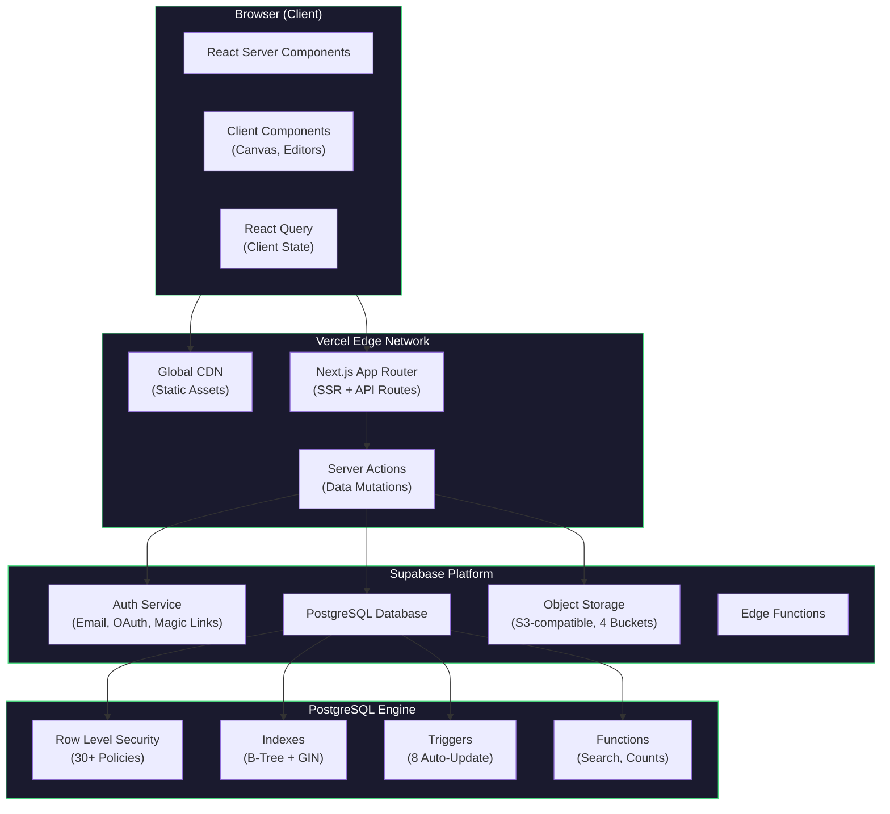
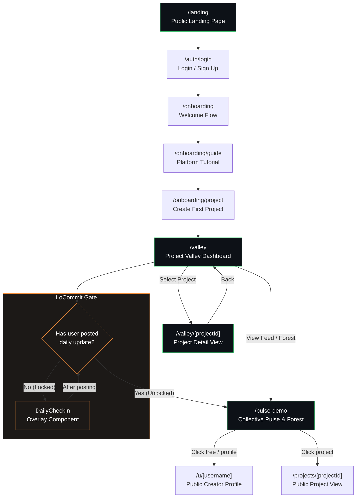
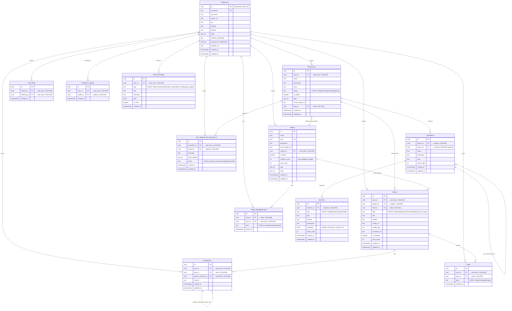

# Trybe — Capstone Project Technical Documentation

## 1. Introduction

### 1.1 Problem Statement

Independent creators face three compounding challenges that existing tools fail to address as a unified system:

1. **Tool Fragmentation.** A typical creator workflow spans Pinterest (visual references), Notion (planning), Figma (design), and Slack (communication). Each context switch costs an estimated 10–15 minutes of refocusing time, destroying creative momentum.

2. **Creative Isolation.** Solo creators lack the structural accountability that teams naturally provide — daily standups, code reviews, and studio critiques. Without a forcing function, consistency degrades.

3. **Process Invisibility.** Portfolio platforms like Behance and Dribbble only surface polished final products. The iterative process — where learning and growth actually occur — remains hidden, creating survivorship bias in creative communities.

### 1.2 Project Goals

Trybe was built to unify private productivity and public creative sharing into a single platform with three interconnected modules:

| Module | Purpose | Core Mechanic |
|--------|---------|---------------|
| **Project Valley** | Structure creative work | Hierarchical dashboard: Project → Channel → Block |
| **LoCommit Engine** | Enforce daily accountability | "Soft lock" — contribute before you consume |
| **The Forest** | Visualize community consistency | Spatial tree garden — each project is a living tree |

### 1.3 Target Audience

Indie creators (designers, filmmakers, developers, writers) working on personal projects who want structured accountability and community connection without the performative pressure of traditional social media.

---

## 2. Software Architecture

### 2.1 Technology Stack

| Layer | Technology | Rationale |
|-------|-----------|-----------|
| Frontend | Next.js 15 (App Router) | Hybrid SSR/CSR — server rendering for SEO, client components for interactive features |
| UI Framework | Tailwind CSS + Radix UI | Glassmorphism design system with accessible primitives (keyboard nav, screen readers) |
| Backend | Supabase | Backend-as-a-Service — Auth, Database, Storage, Edge Functions in one platform |
| Database | PostgreSQL | Relational integrity for hierarchical data (Project → Channel → Block), advanced querying |
| Security | Row Level Security (RLS) | 30+ policies enforced at the database engine level |
| Search | pg_trgm + GIN indexes | Fuzzy full-text search without external services (no Algolia/Elasticsearch) |
| Deployment | Vercel | Global CDN, Edge deployment, automatic CI/CD from GitHub |
| Storage | Supabase Storage (S3-compatible) | 4 buckets for user uploads with client-side video validation |

### 2.2 Architecture Diagram



### 2.3 Key Architectural Decisions

**Why Next.js 15 (App Router)?**
Trybe requires both SEO-friendly public pages (creator profiles, the Forest) and highly interactive private dashboards (Project Valley, Block Editor). The App Router's hybrid model allows React Server Components for data-heavy pages and Client Components for Canvas-based visualizations — in the same codebase without a separate API layer.

**Why Supabase over custom backend?**
As a solo developer, infrastructure overhead directly competes with feature development time. Supabase provides Auth, Database, Storage, and Edge Functions as a cohesive platform, eliminating the need to stitch together separate AWS services. The tight PostgreSQL integration also enables Row Level Security, which would require significant custom middleware in a traditional Express/Node setup.

**Why PostgreSQL over NoSQL?**
Trybe's data model is strictly hierarchical: `Project → Channel → Block`. This structure requires relational integrity — orphaned blocks or broken parent references must be impossible. PostgreSQL enforces this through foreign key constraints with `ON DELETE CASCADE`. Additionally, complex queries like "find all video blocks in public projects by users who posted a daily update today" are efficient in SQL but computationally expensive in document stores.

---

## 3. Application Page Flow

### 3.1 Route Map

The application consists of 12 routes organized into four functional groups:

| Group | Route | Component | Purpose |
|-------|-------|-----------|---------|
| **Public** | `/` | `page.tsx` | Root redirect |
| | `/landing` | `landing/page.tsx` | Marketing landing page with animated hero tree |
| **Auth** | `/auth/login` | `auth/login/page.tsx` | Email, Magic Link, and Google OAuth login |
| | `/auth/signup` | `auth/signup/page.tsx` | Account creation |
| **Onboarding** | `/onboarding` | `onboarding/page.tsx` | Welcome flow entry |
| | `/onboarding/guide` | `onboarding/guide/page.tsx` | Platform tutorial |
| | `/onboarding/project` | `onboarding/project/page.tsx` | First project creation |
| **Core App** | `/valley` | `valley/page.tsx` | Project Valley dashboard (all projects) |
| | `/valley/[projectId]` | `valley/[projectId]/page.tsx` | Single project detail view |
| | `/projects/[projectId]` | `projects/[projectId]/page.tsx` | Public project view |
| | `/u/[username]` | `u/[username]/page.tsx` | Public creator profile |
| | `/pulse-demo` | `pulse-demo/page.tsx` | Collective Pulse / Forest view |

### 3.2 Navigation Flow Diagram



### 3.3 LoCommit Lock — Middleware Behavior

The LoCommit "soft lock" is enforced at the component level via the `getDailyLockStatus()` function in `src/lib/daily-lock.ts`. When a user navigates to a social feature (Pulse, Forest), the system:

1. Calculates the most recent 9:00 AM Taiwan Time (UTC+8) reset boundary
2. Queries the `posts` table for any `daily_update` record created after that boundary
3. If no record exists, renders the `DailyCheckIn` overlay component, preventing access to the feed
4. After the user submits a daily update, the lock clears and social features become accessible

This is a **client-side enforcement** pattern — the lock status is computed per-request rather than via Edge Middleware, keeping the architecture simple while achieving the behavioral constraint.

---

## 4. Database Schema

### 4.1 Entity Relationship Diagram



### 4.2 Schema Design Decisions

**Hierarchical Data Model.** The core data structure follows strict third normal form (3NF): `Project → Channel → Block`. Channels support self-referential nesting via `parent_id`, enabling arbitrary depth without schema changes. Blocks use a `type` CHECK constraint with a flexible `metadata` JSONB column — for example, a video block stores `{ duration: 28, orientation: "vertical", width: 1080, height: 1920 }` in metadata while image blocks store `{ width: 800, height: 600 }`.

**Cascade Delete Strategy.** All child entities use `ON DELETE CASCADE` referencing their parent. Deleting a project automatically removes its channels, blocks, and associated posts — preventing orphaned records without application-level cleanup logic.

**Self-Referential Comments.** Comments support threading via `parent_comment_id` referencing the same `comments` table. This allows unlimited nesting depth while keeping the schema flat.

### 4.3 Row Level Security (RLS)

All 13 tables have RLS enabled. Key policy patterns:

| Pattern | Example | Tables Applied |
|---------|---------|----------------|
| **Owner-only write** | `auth.uid() = user_id` | profiles, projects, posts, comments, likes |
| **Public read** | `is_public = true` | projects, tribes |
| **Cascaded visibility** | Channel visible if parent project is public OR owned | channels, blocks |
| **Relational check** | Tribe membership verified via subquery | tribe_memberships, collaboration_requests |
| **Universal read** | Anyone can view | posts, likes, comments, follows |

**Total: 30+ policies** covering SELECT, INSERT, UPDATE, and DELETE operations across all tables.

### 4.4 Database Functions & Triggers

**Triggers (8 total):** Every table with an `updated_at` column has an automatic trigger that sets `updated_at = NOW()` on any UPDATE operation using a shared `update_updated_at_column()` function. Additionally, a `tribe_memberships` trigger automatically increments/decrements the `member_count` on the parent `tribes` row.

**Search Functions:** Two `SECURITY DEFINER` functions — `search_projects()` and `search_tribes()` — implement full-text search using PostgreSQL's `ts_vector` and `plainto_tsquery`. Both support tag-based matching via array overlap (`&&` operator) as a fallback.

### 4.5 Performance Indexes

The database uses targeted B-Tree indexes on high-traffic foreign keys (`user_id`, `project_id`, `tribe_id`) and status columns (`is_public`, `status`). GIN indexes on `name` and `description` fields power the `pg_trgm` fuzzy search — enabling queries like "desgn" to match "design" without external search infrastructure.

---

## 5. Core Feature Implementation

### 5.1 LoCommit Engine

**File:** `src/lib/daily-lock.ts` (40 lines)

The LoCommit (Low-friction Commit) system is the behavioral core of Trybe. It implements a daily accountability mechanism that requires users to post a creative update before accessing social features.

**Logic:**

```typescript
// Simplified from src/lib/daily-lock.ts
export async function getDailyLockStatus(userId: string) {
    const now = new Date()
    
    // 9:00 AM Taiwan Time = 1:00 AM UTC
    const lastResetUTC = new Date(now)
    lastResetUTC.setUTCHours(1, 0, 0, 0)
    
    // If before 1 AM UTC, reset was yesterday
    if (now.getUTCHours() < 1) {
        lastResetUTC.setUTCDate(lastResetUTC.getUTCDate() - 1)
    }
    
    // Query for daily_update posts after the reset boundary
    const { data } = await supabase
        .from('posts')
        .select('id')
        .eq('user_id', userId)
        .eq('type', 'daily_update')
        .gt('created_at', lastResetUTC.toISOString())
        .limit(1)
    
    return { isLocked: !(data && data.length > 0), lastResetTime: lastResetUTC }
}
```

**Design Rationale — "Carrots and Sticks":**

| Carrots (Rewards) | Sticks (Consequences) |
|---|---|
| Tree grows taller with each daily commit | Social features locked until daily post |
| Contribution heatmap builds visible streaks | Tree visually withers without consistent posting |
| Public visibility in the Forest community | Heatmap gaps are honest — no way to fake consistency |

**UI Component:** `src/components/DailyCheckIn.tsx` renders a full-screen overlay when `isLocked === true`. The overlay includes a video upload field (30-second max, vertical orientation) and a caption input. Submission creates a `daily_update` post, immediately clearing the lock.

### 5.2 Project Valley

**Files:** `src/components/ProjectDashboard.tsx`, `src/components/ProjectList.tsx`, `src/components/project-valley.tsx`

Project Valley is the private workspace where creators organize their work. It implements the `Project → Channel → Block` hierarchy:

**Data Flow:**
1. User creates a `Project` with name, description, color, status, and visibility settings
2. Inside each project, `Channels` act as thematic folders (e.g., "Inspiration," "Drafts," "Final Assets")
3. Inside each channel, `Blocks` are atomic content units — polymorphic across six types: `text`, `image`, `video`, `link`, `audio`, `file`

**Dashboard Views:**
- **Overview (Reel & Board):** A cinematic horizontal scroll of video updates ("The Reel") paired with a masonry CSS layout of image blocks ("The Board") — auto-generating a visual moodboard from uploaded assets
- **Resources:** File-system-style interface for managing blocks within channels, with drag-reorder via `order_index`
- **Progress:** Chronological timeline of all `daily_update` posts linked to this project

**Status Machine:** Projects transition through four states: `planning → active → paused → completed`, tracked in the `status` column with a CHECK constraint.

### 5.3 The Forest (Collective Pulse)

**Files:** `src/components/collective-pulse.tsx`, `src/components/ContributionGraph.tsx`

The Forest is a spatial visualization where every project in the community is rendered as a tree in a shared garden. It transforms abstract consistency into a tangible, visual metaphor.

**Tree Rendering:**
- Trees are positioned using **Fermat's Spiral** (`θ = n × golden_angle, r = c × √n`) to distribute them evenly across the canvas without overlap
- Tree height and branch complexity scale with the creator's daily post count — consistent creators have taller, more complex trees
- Trees visually "wither" (reduce opacity, shrink) when posting gaps exceed a threshold

**Contribution Graph:**
The `ContributionGraph.tsx` component renders a GitHub-style heatmap. Intensity is calculated on a 0–4 scale:

| Level | Posts/Day | Color Intensity |
|-------|-----------|----------------|
| 0 | 0 posts | 5% opacity |
| 1 | 1 post | 15% opacity |
| 2 | 2 posts | 30% opacity |
| 3 | 3 posts | 55% opacity |
| 4 | 4+ posts | 85% opacity |

**Feed Logic:** The Collective Pulse queries strictly for `is_public = true` projects, ensuring private work in Valley remains confidential. Posts display contextual badges (project name, post type) and support Like, Comment, and Save interactions.

---

## 6. Technical Challenges & Solutions

### 6.1 The "Infinite Recursion" RLS Deadlock

**Error:** `infinite recursion detected in policy for relation "objects"`

**Context:** When implementing media privacy for Supabase Storage, RLS policies on the `objects` table queried `tribe_memberships` to check access. But `tribe_memberships` itself had policies that queried user identity via other tables, creating a circular dependency that caused the PostgreSQL query planner to enter an infinite loop.

**Solution:** File `supabase/fix_storage_policy.sql` — simplified storage policies to use direct ownership checks (`auth.uid() = owner`) rather than relational subqueries. This shifted from a granular "can this user access this tribe's files?" model to a simpler "does this user own this file?" model. The trade-off: slightly less granular permissions in exchange for guaranteed query termination and sub-100ms response times.

### 6.2 Schema Drift — Missing Foreign Key Relationships

**Error:** `Could not find relationship 'profiles' for 'posts'`

**Context:** Supabase's PostgREST layer auto-detects table relationships for its query builder. When the `posts.user_id` foreign key wasn't explicitly defined to reference `profiles`, the `.select('*, user:profiles(*)')` query pattern failed — preventing the feed from loading user avatars alongside posts.

**Solution:** File `supabase/fix_posts_relationship.sql` — manually defined the foreign key constraint and forced a schema cache reload via `NOTIFY pgrst, 'reload config'`.

### 6.3 Enum Constraint Violations

**Error:** `new row for relation "posts" violates check constraint "posts_type_check"`

**Context:** The `daily_update` post type was added to the frontend application code for the LoCommit feature, but the database-level CHECK constraint on `posts.type` hadn't been updated to include it — causing all daily check-in submissions to fail silently.

**Solution:** File `supabase/fix_post_type_constraint.sql` — dropped the old CHECK constraint and added a comprehensive new one including `daily_update` as a valid enum value. This highlighted the importance of treating database constraints as the source of truth for allowed values, not application code.

---

## 7. User Testing & Outcomes

### 7.1 Testing Approach

A structured user testing plan was designed with the following scope:
- **Duration:** 5-day testing period to assess commitment and daily accountability patterns
- **Participants:** Target of 5–8 indie creators across design, development, and writing disciplines
- **Focus Areas:** Onboarding clarity, Valley usability, LoCommit compliance, Forest comprehension

### 7.2 Key Findings

- **LoCommit adoption:** Users reported that the daily lock "felt like a gentle nudge, not a punishment" — the constraint framing ("contribute before you consume") was well-received
- **Valley organization:** The Project → Channel → Block hierarchy matched creators' mental models for organizing work
- **Forest comprehension:** Users intuitively understood the tree growth metaphor; one tester noted "I didn't want to let my tree wither"
- **Pain points:** The fixed 9 AM Taiwan timezone reset was confusing for users in other timezones; the lack of real-time updates on the Forest required manual refreshing

---

## 8. Strengths & Limitations

### 8.1 Strengths

| Strength | Evidence |
|----------|----------|
| **Behavioral forcing function** | LoCommit structurally requires contribution — it's not a passive reminder, it's an architectural constraint |
| **Architecture-level privacy** | 30+ RLS policies enforced at the PostgreSQL engine level; security is a database guarantee, not application middleware |
| **Native search** | `pg_trgm` with GIN indexes provides fuzzy full-text search without external service dependencies |
| **Unified workspace** | Project Valley consolidates moodboards, drafts, videos, and links into one hierarchical dashboard |
| **Novel visualization** | The Forest's spatial tree metaphor for creative consistency has no direct equivalent in existing platforms |

### 8.2 Limitations

| Limitation | Impact | Planned Resolution |
|------------|--------|-------------------|
| Fixed timezone reset (9 AM UTC+8) | Users outside Asia experience mis-aligned daily cycles | Per-user timezone configuration |
| Tribes not shipped | Schema defined but UX not implemented; social layer is thin | Priority feature for next iteration |
| No real-time updates | Forest and feed require page refresh | Supabase Realtime (WebSocket via LISTEN/NOTIFY) |
| Single-developer scope | Some features (notifications, collab requests) are schema-ready but not UI-complete | Incremental rollout |

---

## 9. Future Work

### 9.1 Tribes
Creator-led micro-communities centered around specific crafts. The database schema (`tribes`, `tribe_memberships`) is already defined with RLS policies; implementation requires the frontend group management UI and invitation flow.

### 9.2 AI Portfolio Generation
Aggregate the last 30 `daily_update` posts of a completed project, transcribe video audio, and feed transcripts to an LLM (e.g., Gemini 1.5 Flash) with a system prompt to generate a cohesive case study. Users would review and refine the AI draft before publishing to their profile.

### 9.3 Per-User Timezone
Replace the fixed UTC+8 offset in `daily-lock.ts` with a per-user timezone stored in the `profiles` table. The reset calculation would use the user's local 9:00 AM rather than a global constant.

### 9.4 Real-Time Updates
Subscribe to Supabase Realtime channels on the `posts` table so Forest tree growth and feed updates appear instantly without page refresh — using PostgreSQL's native `LISTEN/NOTIFY` mechanism.

---

## Appendix A: Higher-Order Competencies (HC) & Learning Outcomes (LO)

### HC Application in Development

**#purpose** — Applied as a feature-trimming razor. Removed "Algorithmic Feed" in favor of chronological context; simplified Project Dashboard from generic CRM to visual-first "Reel & Board" layout by asking "Does this button help the user enter a flow state?"

**#persuasion** — The LoCommit system is the direct manifestation: the "Soft Lock" is a constraint-based persuasive design pattern that structurally requires creation before consumption. The Contribution Graph leverages loss aversion ("don't break the chain") as a gamified incentive.

**#communicationdesign** — Drove the Glassmorphism design system: transparency and blur effects communicate UI depth hierarchy (content in focus, navigation floating above). Dark-mode-first design signals empathy with creators who work late.

**#breakitdown** — Development was phased into Foundation (Schema + Auth), Mechanics (LoCommit + Storage), and Experience (UI + Social). Atomic component decomposition (Block, Channel, Project) enabled modular development and isolated debugging.

**#plausibility** — Mid-development reality check: real-time multiplayer cursors (Figma-style) were deemed implausible given solo-developer constraints. Pivoted to Optimistic UI via Server Actions — feels responsive but uses standard HTTP, which is robust and deployable on Vercel without WebSocket infrastructure.

**#designthinking** — Accessibility via Radix UI primitives (keyboard nav, screen readers). Addressed dark-mode eye strain through high-contrast token iteration. Auto-generated moodboards from uploaded assets remove the "blank page" anxiety.

---

## Appendix B: Market Context

*Note: This appendix provides business-level context. The core evaluation should focus on the technical implementation documented in Sections 2–6.*

**Target Market:** The independent creator economy encompasses an estimated 50M+ individuals globally who monetize creative skills outside traditional employment. Current tool fragmentation (Notion + Behance + Discord) creates friction that Trybe's unified model addresses.

**Differentiation:**

| Feature | Trybe | Behance | Notion | Discord |
|---------|-------|---------|--------|---------|
| Hierarchical project management | ✓ | — | ✓ | — |
| Daily accountability mechanism | ✓ | — | — | — |
| Spatial community visualization | ✓ | — | — | — |
| Process-first sharing (not just finals) | ✓ | — | — | ✓ |
| Database-level privacy (RLS) | ✓ | — | — | — |

**Monetization Potential:** Freemium model — free tier (3 projects, basic Forest), Pro tier (unlimited projects, AI portfolio generation, analytics dashboard). Infrastructure costs scale linearly with Supabase and Vercel pricing tiers.
