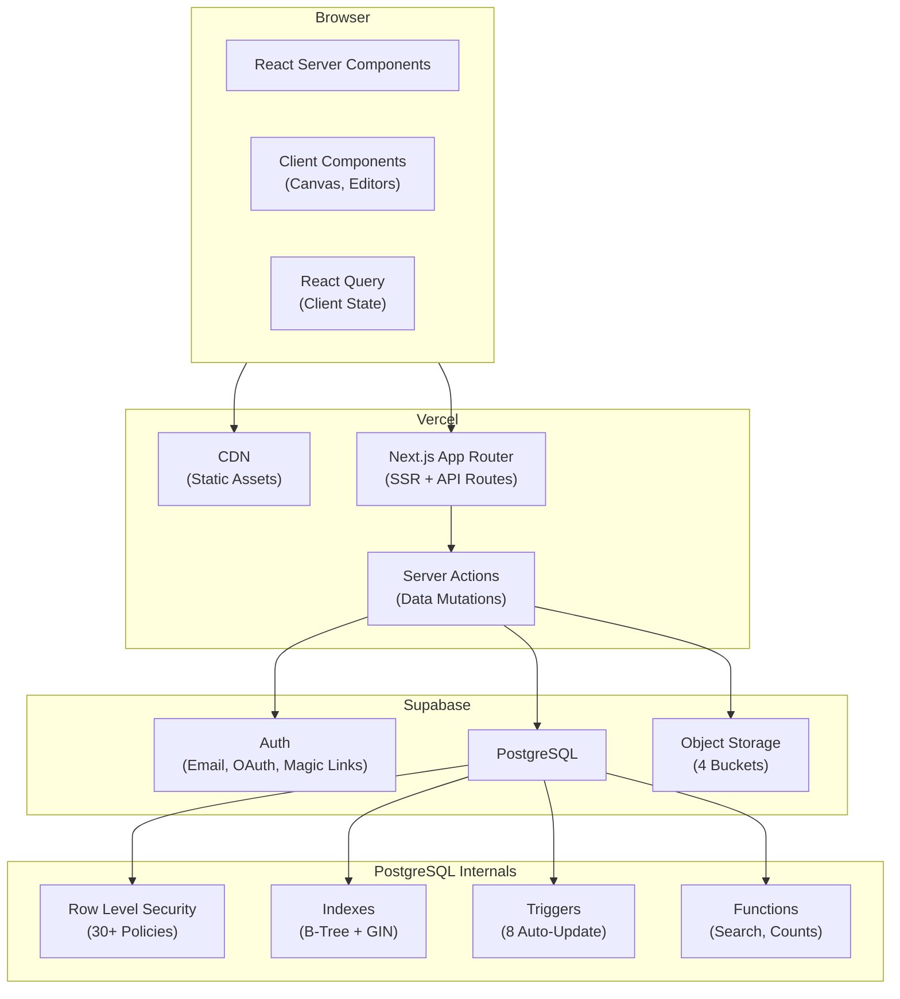
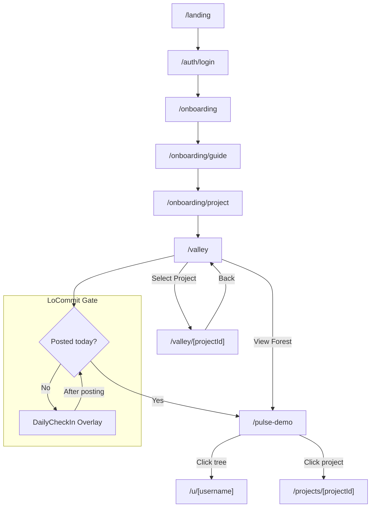
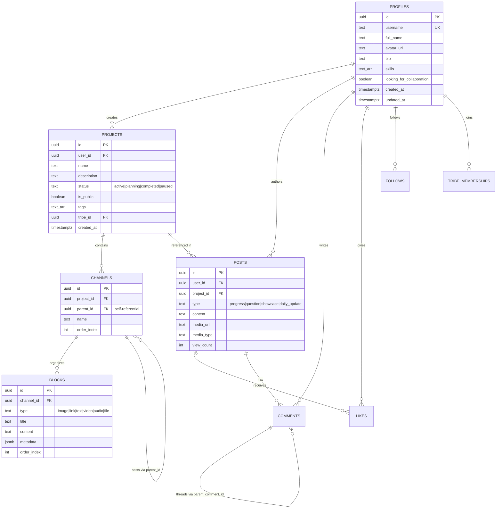

# Trybe — Capstone Project

## 1. What Trybe Is

Trybe is a web application for independent creators who work on personal projects. It combines a project workspace, a daily check-in system, and a community visualization into one tool.

The application solves a practical problem: creators typically use several disconnected tools (Notion for planning, Pinterest for references, Figma for design, Discord for community). Trybe puts all of these functions in one place and adds a daily accountability system that doesn't exist in any of those tools.

The application has three parts:

| Part | What it does |
|------|-------------|
| **Project Valley** | A private workspace where users organize projects into folders (Channels) and individual items (Blocks — text, images, videos, links, files) |
| **LoCommit** | A daily check-in that locks social features until the user posts a progress update. The lock resets every day at 9:00 AM Taiwan time |
| **The Forest** | A shared canvas where every project is drawn as a tree. Trees grow taller as users post more updates. Inactive projects visibly wither |

The app is live at [trybe-six.vercel.app](https://trybe-six.vercel.app).

---

## 2. Software Architecture

### 2.1 Stack

| Layer | Technology | Why this choice |
|-------|-----------|----------------|
| Frontend | Next.js 15 (App Router) | Needed both server-rendered public pages and interactive dashboards in one codebase |
| UI | Tailwind CSS + Radix UI | Radix provides accessible UI primitives (keyboard navigation, screen readers); Tailwind handles styling |
| Backend | Supabase | Provides auth, database, and file storage as a single service. As a solo developer, this eliminated the need to configure and connect separate AWS services |
| Database | PostgreSQL | The data model is hierarchical (Project → Channel → Block). PostgreSQL enforces this with foreign keys and cascade deletes — orphaned data is impossible |
| Security | Row Level Security (RLS) | 30+ database-level policies control who can read and write what. Security is enforced by the database engine, not by application code |
| Search | pg_trgm + GIN indexes | Fuzzy full-text search handled entirely by PostgreSQL. No external search service needed |
| Deployment | Vercel | Automatic deployment from GitHub pushes. Static assets served from a CDN |
| File Storage | Supabase Storage | S3-compatible object storage. Four buckets for different upload categories |

### 2.2 Architecture Diagram



### 2.3 Why These Choices

**Next.js 15 (App Router):** The app needs server-rendered pages for public profiles (so they load fast and are indexable) and client-side components for the Forest canvas and drag-and-drop editors. The App Router lets both coexist in the same project without a separate API server.

**Supabase instead of a custom backend:** Building authentication, file uploads, and database management from scratch would have consumed most of the development time. Supabase bundles all three. The tradeoff is vendor lock-in, but for a capstone project the speed gain was worth it.

**PostgreSQL instead of a document database:** Trybe's data is relational — a Block belongs to a Channel, which belongs to a Project, which belongs to a User. This structure maps naturally to SQL tables with foreign keys. A document store like MongoDB would require manual enforcement of these relationships in application code, which is error-prone.

---

## 3. How the Application Works — User Walkthroughs

### 3.1 Walkthrough: First-Time User

A new user visits the app and sees the landing page. They sign up using email, Google OAuth, or a magic link. After authentication, they go through a short onboarding flow:

1. **Welcome screen** (`/onboarding`) — explains the three pillars of the app
2. **Guide** (`/onboarding/guide`) — walks through the Valley, LoCommit, and Forest
3. **First project creation** (`/onboarding/project`) — the user gives their project a name, description, and status (Planning, Active, Paused, or Completed)

After onboarding, they land in Project Valley — their private dashboard.

### 3.2 Walkthrough: Creating and Organizing a Project

Inside Valley, the user sees all their projects listed in a sidebar. Selecting a project opens a detail view with three tabs:

**Tab 1 — Moodboard / Overview:**
Uploaded images are automatically arranged in a masonry grid (a visual moodboard). Video updates scroll horizontally in a "Reel" format. This gives the user a visual summary of their project at a glance.

**Tab 2 — Resources:**
This is a file-manager-style interface. The user creates Channels (folders) inside their project — for example, "Inspiration," "Drafts," and "Final Assets." Inside each Channel, they add Blocks. A Block is a single piece of content:

| Block Type | What it stores |
|-----------|---------------|
| Text | Written notes, briefs, or journal entries |
| Image | Photos, screenshots, reference images |
| Video | Progress recordings (validated: max 30 seconds, vertical orientation) |
| Link | External URLs (Figma files, articles, etc.) |
| Audio | Sound files, voiceover recordings |
| File | Any other document |

Each Block stores its metadata in a flexible JSONB column — for example, a video Block records `{ duration: 28, orientation: "vertical", width: 1080, height: 1920 }`.

**Tab 3 — Progress:**
A chronological timeline of all daily updates posted about this project. This serves as a log of what the user worked on each day.

### 3.3 Walkthrough: The Daily LoCommit

When the user tries to visit the community feed or Forest, the app checks whether they've posted a daily update since the most recent 9:00 AM Taiwan time (UTC+8) reset.

If they haven't, a full-screen overlay appears — the DailyCheckIn component. They cannot dismiss it. To unlock social features, they must:

1. Upload a short video or image of their progress
2. Write a caption describing what they worked on
3. Click "Submit & Unlock"

After submitting, the overlay clears and they can browse the Forest and community feed for the rest of the day. The next morning at 9 AM, the lock resets.

The actual check is a single database query:

```typescript
// src/lib/daily-lock.ts
const { data } = await supabase
    .from('posts')
    .select('id')
    .eq('user_id', userId)
    .eq('type', 'daily_update')
    .gt('created_at', lastResetUTC.toISOString())
    .limit(1)

return { isLocked: !(data && data.length > 0) }
```

### 3.4 Walkthrough: The Forest

After posting their daily update, the user can access The Forest — a shared canvas where every public project is represented as a tree.

How the trees work:
- **Position:** Trees are arranged using Fermat's Spiral (`θ = n × golden_angle, r = c × √n`), which distributes them evenly across the canvas without overlap
- **Height:** Each daily commit adds a node to the tree's trunk. A user who has posted 30 updates has a tree that is 30 nodes tall
- **Branches:** Engagement from other users (comments, likes) grows visible branches off the trunk
- **Withering:** If a user stops posting for more than 48 hours, their tree fades to grayscale and shrinks — a visual signal that the project is inactive

Clicking on a tree navigates to that creator's public profile, where you can see their public projects and contribution heatmap.

### 3.5 Contribution Heatmap

Each user has a GitHub-style contribution graph. It shows one cell per day, colored by activity level:

| Level | Posts that day | Appearance |
|-------|--------------|------------|
| 0 | None | Nearly transparent |
| 1 | 1 post | Light green |
| 2 | 2 posts | Medium green |
| 3 | 3 posts | Strong green |
| 4 | 4+ posts | Full intensity |

This is computed at read time from the `posts` table — there's no separate counter to maintain or keep in sync.

---

## 4. Application Routes

The app has 12 routes:

| Route | What the user sees |
|-------|--------------------|
| `/` | Redirects: authenticated users go to Valley, others go to landing page |
| `/landing` | Public marketing page with animated tree demonstration |
| `/auth/login` | Login form (email/password, Google OAuth, magic link) |
| `/auth/signup` | Account creation |
| `/onboarding` | Welcome screen |
| `/onboarding/guide` | Platform tutorial |
| `/onboarding/project` | First project setup |
| `/valley` | Project dashboard — lists all user's projects |
| `/valley/[projectId]` | Single project detail view (Moodboard, Resources, Progress tabs) |
| `/projects/[projectId]` | Public view of a project (read-only, for visitors) |
| `/u/[username]` | Public creator profile (bio, public projects, contribution graph) |
| `/pulse-demo` | Community feed and Forest visualization |

### Navigation Flow



---

## 5. Database Schema

### 5.1 Tables

The database has 13 tables. The core hierarchy is `profiles → projects → channels → blocks`. The social layer adds `posts`, `comments`, `likes`, `follows`, and `tribes`.



### 5.2 How the Schema Enforces Data Integrity

**Foreign keys with cascade deletes:** Deleting a project automatically removes all its channels, blocks, and posts. There is no cleanup code in the application — the database handles it.

**CHECK constraints:** The `status` column on projects only accepts four values: `active`, `planning`, `completed`, `paused`. Posts only accept defined types. Block types are limited to six options. These are enforced by the database, not by form validation in the UI.

**Unique constraints:** Users can only like a post once (`UNIQUE(user_id, post_id)`). Users can only follow someone once. Tribe membership is unique per user-tribe pair. These prevent duplicates regardless of race conditions in the application.

### 5.3 Row Level Security

Every table has RLS enabled. The key patterns:

| What the policy does | SQL pattern | Applied to |
|---------------------|-----------|-----------|
| Only the owner can edit | `auth.uid() = user_id` | profiles, projects, posts |
| Anyone can read public data | `is_public = true` | projects, tribes |
| Child data inherits parent visibility | Join to parent table's policy | channels, blocks |
| Users can only see their own notifications | `auth.uid() = user_id` on SELECT | notifications |

The total is 30+ policies across 13 tables. Because these are enforced by PostgreSQL's query planner (they compile into the execution plan), they add negligible performance overhead.

### 5.4 Triggers and Functions

**8 auto-update triggers:** Every table with an `updated_at` column has a trigger that sets it to `NOW()` on any update. One additional trigger on `tribe_memberships` automatically increments or decrements the parent tribe's `member_count`.

**Search functions:** `search_projects()` and `search_tribes()` use PostgreSQL's `ts_vector` for full-text search with `plainto_tsquery`, plus tag-based matching via array overlap (`&&`) as a fallback. Both run as `SECURITY DEFINER` to bypass RLS for search results.

**Performance indexes:** B-Tree indexes on `user_id`, `project_id`, `tribe_id`, and `is_public`. GIN indexes on text fields for `pg_trgm` fuzzy matching — this lets users type "desgn" and find "design."

---

## 6. Technical Challenges

Three significant bugs were encountered during development. Each required a database migration to fix.

### 6.1 Infinite Recursion in RLS Policies

**Error:** `infinite recursion detected in policy for relation "objects"`

**What happened:** File storage policies checked tribe membership to determine access. But the tribe membership table also had policies that checked user identity through other tables. This created a circular dependency — the database query planner entered an infinite loop.

**Fix:** `supabase/fix_storage_policy.sql` — replaced the complex relational check with a simple ownership check (`auth.uid() = owner`). Less granular, but it terminates reliably.

### 6.2 Missing Foreign Key Between Posts and Profiles

**Error:** `Could not find relationship 'profiles' for 'posts'`

**What happened:** Supabase's API layer (PostgREST) auto-detects table relationships for join queries. The `posts.user_id` column referenced `auth.users`, not `profiles`, so the query `.select('*, user:profiles(*)')` failed. The feed couldn't display usernames or avatars next to posts.

**Fix:** `supabase/fix_posts_relationship.sql` — added an explicit foreign key to `profiles` and forced a schema cache reload with `NOTIFY pgrst, 'reload config'`.

### 6.3 CHECK Constraint Blocking Daily Updates

**Error:** `new row for relation "posts" violates check constraint "posts_type_check"`

**What happened:** The LoCommit feature added a new post type called `daily_update`, but the database's CHECK constraint on `posts.type` still listed only the original types. Every daily check-in submission was silently rejected.

**Fix:** `supabase/fix_post_type_constraint.sql` — dropped the old constraint and created a new one that includes `daily_update`. This was a lesson in keeping database constraints as the source of truth for allowed values, not application code.

---

## 7. User Testing

### 7.1 Test Setup

A 5-day testing period was conducted with users across design, development, and writing disciplines. The test focused on four questions:

1. Can new users complete onboarding without guidance?
2. Does the Valley organizational model match how creators think about their work?
3. Do users comply with the daily LoCommit lock, or does it frustrate them?
4. Do users understand what the Forest represents without explanation?

### 7.2 What Worked

- **Onboarding completion:** Users completed the three-step flow (welcome, guide, first project) without asking questions
- **Valley organization:** The Project → Channel → Block hierarchy was described by one tester as "like folders on my computer but visual." Users created Channels that matched their mental categories without prompting
- **LoCommit compliance:** Users posted daily updates consistently. The framing mattered — "contribute before you consume" felt like a fair trade, not a punishment. One user said: "I didn't want to let my tree wither"
- **Forest comprehension:** Users immediately understood that taller trees meant more consistent creators. The spatial layout invited exploration

### 7.3 What Didn't Work

- **Timezone confusion:** The fixed 9 AM Taiwan time reset meant users in other timezones had their "day" start at unexpected hours. A user in UTC-5 had their reset at 8 PM local time
- **No notifications:** Users had no way to know when someone commented on their post or liked their project. They had to check manually
- **Page refresh needed:** The Forest didn't update in real time. If someone posted while you were viewing the Forest, you had to refresh to see their tree grow

---

## 8. Strengths and Limitations

### What works well

- **The LoCommit lock is effective.** It's not a reminder notification that users can dismiss — it's a structural constraint. Users must contribute before they can consume. This is the core design idea, and it works.
- **Data security is handled at the right level.** RLS policies are enforced by PostgreSQL, not by application middleware. Even a bug in the frontend code can't expose another user's private data.
- **Search works without external services.** PostgreSQL's `pg_trgm` extension with GIN indexes handles fuzzy search. There's no Algolia or Elasticsearch bill to manage.
- **The Forest is a novel interface.** No existing creative platform uses spatial tree metaphors for visualizing community activity. It's an experiment that users found intuitive and engaging.

### What needs improvement

- **Timezone handling is too rigid.** The daily lock reset should be per-user, not global. This requires adding a timezone field to the `profiles` table and modifying `daily-lock.ts`.
- **Tribes are not implemented.** The database tables (`tribes`, `tribe_memberships`) and RLS policies exist, but there is no user interface for creating or joining a tribe. The social layer is currently limited to public/private project visibility.
- **No real-time updates.** The Forest and feed require manual page refresh. Supabase supports WebSocket channels via PostgreSQL's `LISTEN/NOTIFY`, but this hasn't been wired up yet.
- **Notifications are schema-only.** The `notifications` table exists with RLS policies, but the frontend doesn't display them. Users have no way to know when someone engages with their work.

---

## 9. Future Work

**Per-user timezone:** Add a `timezone` column to `profiles` and replace the hardcoded UTC+8 offset in `daily-lock.ts` with the user's local 9:00 AM.

**Tribes:** Build the frontend for tribe creation, discovery, and membership. The database layer is already complete.

**Real-time feed:** Subscribe to Supabase Realtime channels on the `posts` table so the Forest updates live when someone posts.

**AI portfolio generation:** Aggregate the last 30 daily updates of a completed project, transcribe video audio, and use an LLM to generate a draft case study. The user reviews and edits before publishing.

---

## Appendix: Higher-Order Competencies (HC) & Learning Outcomes (LO)

**#purpose** — Used to cut features. Removed "Algorithmic Feed" in favor of chronological display; simplified the project dashboard from a generic CRM to a visual moodboard/reel layout.

**#persuasion** — The LoCommit lock is a constraint-based design pattern. The contribution heatmap uses loss aversion ("don't break the chain") as motivation.

**#communicationdesign** — The dark-mode-first Glassmorphism design system uses transparency and blur to communicate depth hierarchy. Content stays in focus; navigation floats above it.

**#breakitdown** — Development was phased: Foundation (schema + auth), Mechanics (LoCommit + storage), Experience (UI + social). Each phase had testable deliverables.

**#plausibility** — Decided against real-time multiplayer cursors (would require WebSocket infrastructure beyond the project scope). Used Optimistic UI via Server Actions instead — standard HTTP that feels fast.

**#designthinking** — Used Radix UI primitives for accessibility (keyboard navigation, screen readers). Iterated on dark-mode contrast tokens after testing revealed eye strain.
