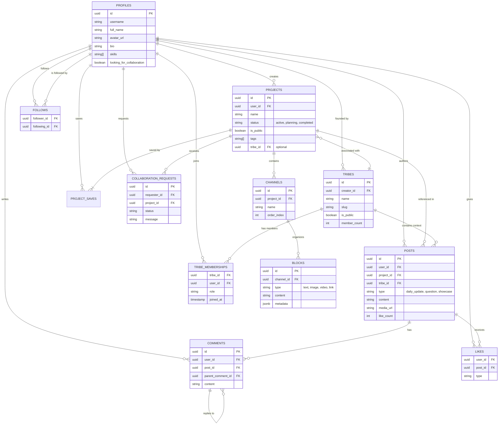

# Appendix B: Database Schema Diagram (ERD)

The following diagram illustrates the relational structure of the Trybe database, highlighting the connections between the core "Project Valley" entities (Projects, Channels, Blocks) and the "Collective Pulse" social layer (Posts, Likes, Comments, Tribes).

